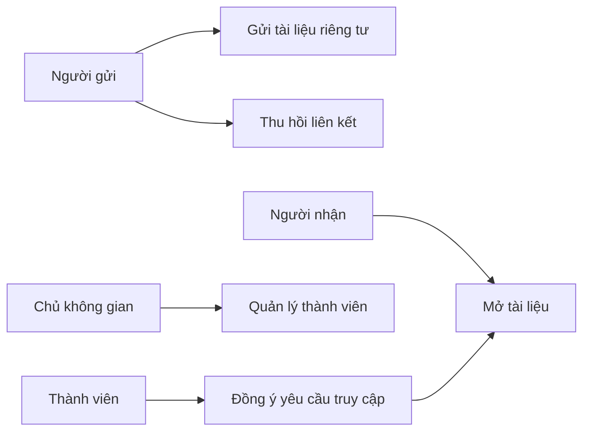
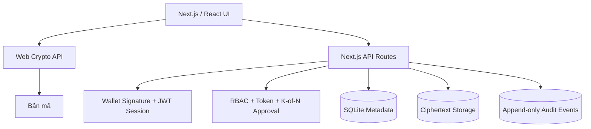

# Hồ sơ kỹ thuật phần mềm - Vaultline

## 1. Bài toán

Vaultline là nền tảng chia sẻ tài liệu riêng tư. Người gửi có thể giới hạn người nhận,
thời gian và số lượt tải; thu hồi quyền sau khi gửi; cộng tác theo vai trò; hoặc yêu
cầu nhiều thành viên cùng đồng ý trước khi một tài liệu nhạy cảm được mở.

## 2. Tác nhân và use case

| Tác nhân | Use case chính |
| --- | --- |
| Người gửi | Gửi tài liệu, đặt thời hạn, giới hạn lượt tải, thu hồi liên kết |
| Người nhận | Nhận và mở tài liệu được gửi đích danh |
| Thành viên nhóm | Xem hoặc cập nhật tài liệu theo vai trò |
| Người phê duyệt | Đồng ý cho yêu cầu mở tài liệu nhạy cảm |
| Chủ không gian | Quản lý thành viên, vai trò và quy tắc nhiều người duyệt |

## 3. Kiến trúc

- Tệp rõ và khoá chưa bọc chỉ tồn tại trên thiết bị người dùng.
- Máy chủ lưu bản mã, metadata, quyền truy cập và nhật ký.
- API kiểm tra phiên đăng nhập, CSRF, vai trò, thời hạn và giới hạn lượt tải.
- Audit events có trigger ngăn cập nhật và xoá.

## 4. Mô hình dữ liệu chính

| Nhóm | Bảng |
| --- | --- |
| Tài liệu | `files`, `tokens`, `key_envelopes` |
| Cộng tác | `vaults`, `vault_members` |
| Phê duyệt | `vault_threshold_policies`, `threshold_file_shares`, `approval_requests`, `approval_contributions` |
| Bảo mật | `encryption_identities`, `audit_events`, `rate_limits` |

Quan hệ quan trọng:

- Một tài liệu có nhiều liên kết và nhiều phiên bản logic.
- Một không gian có nhiều thành viên với vai trò `owner`, `editor`, `viewer`.
- Một yêu cầu truy cập có nhiều đóng góp phê duyệt.
- Mọi thay đổi nhạy cảm sinh một audit event bất biến.

## 5. Yêu cầu phi chức năng

| Thuộc tính | Cách đáp ứng |
| --- | --- |
| Bảo mật | AES-256-GCM, PBKDF2, ECDH P-256, CSRF, JWT, rate limit |
| Riêng tư | Mã hoá phía trình duyệt; máy chủ không đọc được nội dung |
| Toàn vẹn | GCM xác thực bản mã; audit log không thể sửa hoặc xoá |
| Khả dụng | Responsive UI, trạng thái lỗi rõ ràng, luồng E2E tự động |
| Bảo trì | Tách API, component, access-control helper và crypto helper |
| Mở rộng | Có thể thay local ciphertext storage bằng S3/IPFS/Filecoin |

## 6. Quyết định thiết kế

- SQLite và local storage được chọn cho prototype lớp học để demo ổn định.
- Web Crypto API tránh tự triển khai thuật toán mật mã.
- Ví được dùng để chứng minh quyền sở hữu tài khoản, không lưu mật khẩu người dùng.
- Shamir Secret Sharing hỗ trợ quy trình K-of-N mà không giao toàn bộ khoá cho một người.
- Không dùng super-admin đọc được mọi tài liệu. Mỗi không gian có một `owner` làm
  quản trị viên cục bộ; `editor` được cập nhật tài liệu và `viewer` chỉ được xem.
  Mô hình này giảm quyền lực tập trung và phù hợp với mục tiêu riêng tư.

### Ma trận phân quyền

| Chức năng | Owner | Editor | Viewer | Chưa đăng nhập |
| --- | --- | --- | --- | --- |
| Xem metadata trong không gian | Có | Có | Có | Không |
| Tải phiên bản mới lên không gian | Có | Có | Không | Không |
| Tạo/thu hồi liên kết chia sẻ | Có | Có | Không | Không |
| Quản lý thành viên và quy tắc duyệt | Có | Không | Không | Không |
| Đồng ý yêu cầu K-of-N | Nếu đủ điều kiện | Nếu đủ điều kiện | Nếu đủ điều kiện | Không |
| Xem dashboard cá nhân | Có | Có | Có | Không |

## 7. Giới hạn và hướng phát triển

- Chưa hỗ trợ mã hoá streaming cho tệp lớn.
- Chưa có email/push notification.
- Chưa có hệ thống quan sát production và xuất audit log.
- Chưa có ký điện tử pháp lý hoặc hợp đồng thông minh on-chain.
